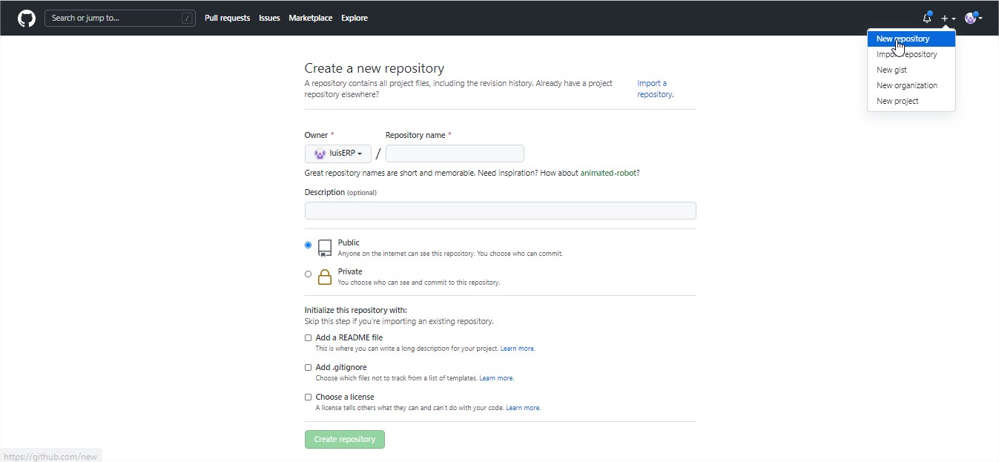
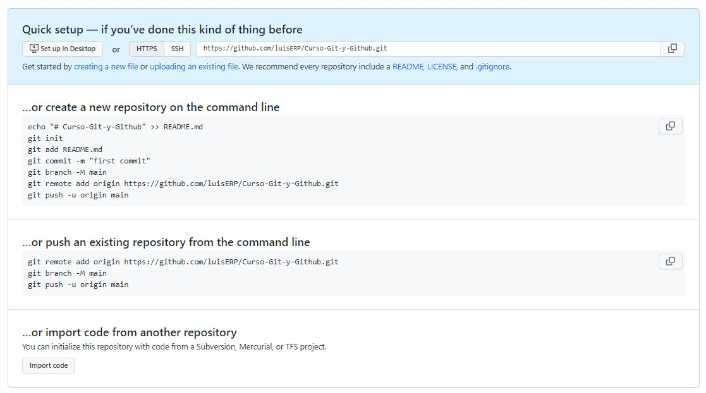
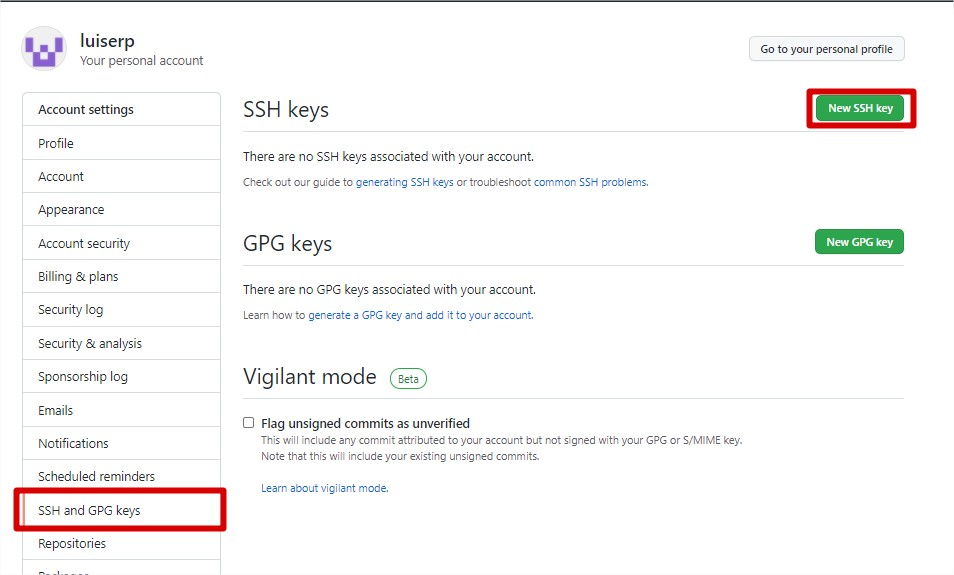

# Configurando Git

## Comandos:
1. ```git config -l``` 
2. ```git config --global user.name *minombre*```
3. ```git config --global user.email *minombre@micorreo.com*```
4. ```git config --global credential.helper cache```
5. ```git config --global credential.helper 'cache --timeout=31536000'```
6. ```git config --global credential.helper store```

### Descripción:
1. Muestra un lista de todas las configuraciones globales de git.
2. Configura el nombre de usuario.
3. Configura el la contraseña.
4. Configura para que las credenciales se almacenen en cache. Se puede usar tambien el administrador de credenciales.
5. Establece el tiempo(en segundos) que duran las crecdenciales en cache.
6. Configura para que las credenciales sean guardadas en un archivo de texto plano en el directorio *~/.git-credentials*.

# Comandos Básicos de Git.

## Iniciar Repositorio

Iniciar un nuevo repositorio, agregar los archivos y generar una entrada en la BD local de git. Luego de este paso lo que se hace es ir agregando entradas con `git add` especificando el nombre del archivo a agregar o `.` para que agregue todo el contenido de la carpeta y seguir haciendo commits.

1. ```git init```
2. ```git add Comandos Git.md | git add .```
3. ```git commit -m 'Mensage o descripcion'```

## Obteniendo informacion sobre los archivos rastreados.

### Comando:

1. ```git status```
2. ```git log  Comandos Git.md```
    * ```git log --all --graph --decorate --oneline```
        * ```alias tree="git log --all --graph --decorate --oneline"```
    * ```git reflog```
3. ```git show Comandos Git.md```
4. ```git diff f037bd8d1e3a9ec662ff19dd28b79e6ec616d74c 3a12197528d37295480c77038b84aeabc29106e4```
5. ```git grep palabra```
    * ```git grep -n palabra```
    * ```git grep -c palabra```
6. ```git log -S "palabra"```
7. ```git shortlog```
    * ```git shortlog -sn --all --no-merges```

### Descripción:

1. Muestra el estado actual del repositorio.
2. Muestra el registro de todos los commits aplicados sobre el archivo.
    * Muestra el historial completo de nuestro proyecto de forma comprimida y mas atractica visualmente.
        * Crea el alias para que el comando no sea tan largo.
    * Muestra el historial **completo**, incluso si son reseteados los cambios y no aparecen mediante el comando `git log`
3. Muestra el ultimo cambio que se hizo.
4. Compara dos commits y muestra los cambios, el **orden** de los commits es importante
5. Busca la palabra especificada en los archivos rastreados.
    * Muestra las lineas y archivos donde estan las palabras.
    * Muestra la cantidad de veces que se repite esa palabra.
6. Hace una busqueda de la palabra dentro de los **commits**.
7. Muestra los commits hechos por cada persona del equipo.
    * Muestra las estadisticas, eliminando los merges para no tener datos de mas.

## Moviendonos entre versiones

### Comandos:

1. ```git reset f037bd8d1e3a9ec662ff19dd28b79e6ec616d74c [ --soft | --hard ]```
2. ```git checkout [ f037bd8d1e3a9ec662ff19dd28b79e6ec616d74c | master ]```
3. ```git log --stat```

### Descripción:

1. Vuelve a una version anterior y posiciona head en esta, las opciones `soft` y `hard` especifican de que forma lo hacen, `soft` deja los cambios actuales en el archivo y `hard` los **borra(precaucion)**.
2. Se mueve entre los commits y la version actual(master).
3. Muestra los cambios entre commits especificando las inserciones y eliminaciones realizadas. 

# Flujo de Trabajo.

### Comandos:

1. ```git commit -am "Mensage"```
    * ```git commit --amend```
2. ```git branch *nombredelarama*```
3. ```git checkout *nombredelarama*```
4. ```git checkout -b *nombredelarama*```

### Descripción:

1. Una ves añadidos los archivos al repositorio se le agrega la bandera `-a` para saltarnos el paso de `git add ...`
    * Una ves hecho el **commit** podemos agregarle los cambios nuevos sin necesidad de hacer un **commit** nuevo, util cuando olvidamos hacer algo que se debió haber hecho.
2. Crea una rama con el nombre especificado.
3. Cambia a la rama especificada.
4. Crea la rama y automaticamente se cambia a esta. Son los dos pasos anteriores en un solo comando.

## Como hacer un merge de dos ramas:

### Observaciones:

* Las ramas deben ser cerradas con un **commit**, si hay un cambio luego de un **commit** este cambio se va a perder en el merge.
* Posicionarse en la rama de destino, o sea, la rama en la que se va a encontrar el **head** luego del merge.

### Contexto:

Teniendo 2 ramas( master y desarrollo ), ambas ramas con diferencias y conflictos ( mismas lineas cambiadas en las 2 ramas ). Y con el **HEAD** situado en master.

### Comandos:
1. ```git merge desarrollo```

### Descripción:
1. git automaticamente intentara realizar el merge, aplicando los cambios realizados en las 2 ramas y generara un **nuevo commit** en la rama actual. En caso de existir **conflictos** pondra una señal de conflicto en las lineas de los archivos con problemas.

# Repositorios remotos

Lo primero es crear el repositorio en la plataforma que se desee, en este ejemplo se usa github. Autoseguido se necesita configurar nuestro repositorio local para decirle cual es la direccion del repositorio remoto.

### Procedimiento:

[](./assets/new_repo.jpg "Nuevo repositorio en github")

Para configurar el repositorio local se debe copiar la dirreccion https ( inicialmente, luego veremos mediante ssh ) del repositorio, git da la dirreccion justo despues de crear el repositorio. En la siguiente imagen se ve la direccion, es solo darle copiar mediante el boton del final.

[](./assets/empty_repo.jpg "Repositorio vacio")

### Comandos:

1. ```git remote add origin https://github.com/luisERP/Curso-Git-y-Github.git```
2. ```git branch -M main```
3. ```git push -u origin main```

### Descripción:

Estos son los comandos que recomienda git al crear un repositorio. Basicamente añade el origen remoto del repositorio( lo nombra origin, pero se puede llamar de cualquier forma, es solo un estandar llamarlo asi ), cambia la rama por defecto a **main** ( localmente la rama principal es master, github esta cambiando el nombre de la rama a Main, esta opcion se puede [cambiar](https://github.com/settings/repositories "Cambia nombre por defecto de la rama principal") si asi se desea ) y hace un `push` ( subir el contenido del repositorio a la nube ).

## Algunos comandos extra.

### Comandos:
1. ```git remote```
2. ```git remote -v```
3. ```git push origin master```

### Descripción:
1. Ver las direcciones remotas guardadas( nombres ).
2. Ver la informacion completa de las direcciones remotas guardadas.
3. En esta linea se le dice a git que envie a la direccion *origin* la rama *master*. Enviandose todos los commits e informacion de la rama al servidor especificado luego de hacer el login con los credenciales de la plataforma remota.

## Agregando claves SSH.
Antes de esto se debe verificar que el nombre de usuario y el correo de la congiguracion global d git sean los mismos que el de la plataforma. Para verlo se usa `git config -l`.

### Comandos: 
1. ```ssh-keygen -t rsa -b 4096 -C "minombre@micorreo.com"```
2. ```eval $(ssh-agent -s)```
    * ```bash```
    * ```Set-Service ssh-agent -StartupType Manual```
3. ```ssh-add.exe ~/.ssh/id_rsa```

### Descripción:
1. Crea un par de claves publicas y privadas vinculadas al correo, la clave privada debe ser protegida.
2. Verifica que el servicio **ssh-agent** este activo, en terminal *Cmder* no da respuesta, esto es exitoso, en *git bash* devuelve el pid del **ssh-agent**, de dar error:
    * El comando establece bash como la terminal y se reintenta el comando anterior.
    * Si los comandos anteriores no funcionan se debe abrir una terminal de Power Shell con privilegios administrativos y establecer el inicio de **ssh-agent** como manual.
3. Agregar la llave recien creada al servicio ssh.

### Procedimiento:

1. En github ir a settings, SSH and GPG keys y añadir la clave ssh **publica** recien creada.
    * En el titulo de la clave poner un identificador del dispositivo en donde esta siendo usada esa llave.
    * En el campo de la llave copiar el contenido de la llave **publica**, hibucada en *C:\Users\Luis/.ssh/id_rsa.pub*

[](./assets/new_ssh_key.jpg "Añadir clave a github")


## Usando la clave SSH en nuestro repositorio.

### Comandos:

1. ```git remote -v```
2. ```git remote set-url origin git@github.com:luisERP/Curso-Git-y-Github.git```
    * ```git remote add origin git@github.com:luisERP/Curso-Git-y-Github.git```

### Descripción:

1. Muestra los origenes remotos
2. Cambia la ruta remota del origen *origin* y la establece a la ruta por ssh.
    * En caso de que no exista ningun origen remoto se crea con la ruta de ssh.

## Tags:
Son referencias a versiones del proyecto, no tienen utilidad dentro del proyecto, solo sirven para que las demas personas conozcan las distintas versiones.

### Comandos:

1. ```git tag```
2. ```git tag -a v0.1 -m "Mensage del tag" ea9f9bd```
3. ```git show-ref --tags``
4. ```git push origin --tags```

### Descripción:

1. Muestra los **tags** denntro del proyecto.
2. Crea un **tag** 
3. Muestra los hashes a los que hacen referencia los tags.
4. Envia los tags solamente.


## Enviando otras ramas al repositorio:

### Comandos:

1. ```git branch *nombre*```
2. ```git checkout *nombre*```
3. ```git show-branch --all```
4. ```git push origin *nombre*```
5. ```gitk```

### Descripción:

1. Crea la rama.
2. Cambia el header a la rama nueva.
3. Muestra informacion de todas las ramas.
4. Hace el push de la rama nueva.
5. Muestra una interface grafica con la informacion de las ramas.


## Rebase: Ramas ocultas.

Un `rebase` es muy parecido al merge de dos ramas pero funciona de tal forma que parece q los cambios nunca salieron de una sola rama. Reubica los **commits** de la rama secundaria dentro de la historia de la rama principal.

### Contexto:

Teniendo dos ramas, digamos *master* y *secundaria*, hay cambios en *secundaria* ( 1 o varios **commits** ) y master tiene el ultimo **commit**(el mas recientemente hecho) de la historia.

### Observaciones:

* No es muy buena practica.
* Se debe hacer luego de que la rama *master* sea la mas actualizada( tenga el ultimo commit ).
* Se realiza **primero** el rebase a la rama *secundaria* y luego a la rama *master*. El orden es muy **importante**, pueden ocurrir errores.

### Comandos:
1. ```git checkout secundaria```
2. ```git rebase master```
3. ```git checkout master```
4. ```git rebase secundaria```
5. ```git branch -D secundaria```

### Descripción:
1. Nos posicionamos en la rama secundaria.
2. Hacemos el rebase a la secundaria(traemos todo lo de master).
3. Nos posicionamos en la rama master.
4. Hacemos el rebase a la master(traemos todo lo de secundaria).
5. Elimina la rama *secundaria*, luego de esto no queda constancia alguna de la rama y todos sus cambios pertenecen a *master*.

## Stash: Guardando datos temporalmente.

El **Stash** sirve para guardar de forma temporal los cambios realizados en el entorno de trabajo pero **sin hacer commits**, en ves d eso usa una estructura parecida a una lista. Tenemos comandos disponibles como `pop`, `drop` y `list`.
Luego de hacer el **stash** el entorno vuelve al ultimo **commit** de la rama y los cambios que se habian realizado estan en la memoria, en la lista de **stashs**.

### Comandos:
1. git stash
2. git stash list
3. git stash pop
    * git stash branch *nombredelarama*
4. git stash drop

### Descripción:
1. Crea el **stash**, guardando los cambios y vuelve al ultimo **commit** de la rama. Luego de esto se puede cambiar de **rama**, hacer **checkout** a algun commit, etc.
2. Muestra la lista d stash existentes.
3. Aplica los cambios del **stash** y lo elimina de la lista de **stashs**.
    * Opcionalmente podemos hacer una **nueva rama** con los cambios en **stash**.
4. Elimina el contenido del **stash**.

## Clean: Limpiando el repositorio

Una vez que git conoce la estructura del repositorio, todos sus archivos y directorios, si se añaden nuevos archivos ya sea por error o mediante la ejecucion de la aplicacion que estamos desarrollando podemos usar el comando `clean` para limpiar esos archivos extra.

### Comandos:
1. ```git clean --dry-run```
2. ```git clean -f```

### Descripción:
1. Muestra los archivos que seran afectados por la limpieza, pero no los borra.
2. Borra los archivos extra.

## Cherry-pick: Commits de otras ramas al head.

El comando `cherry-pick` trae el **commit** especificado mediante el **hash** al head de la rama actual. Es util para traer cambios especificos que ocurren en otras ramas pero la misma no esta lista para fusionarse todavia, en cambio ese **commit** en especifico si se puede traer.

### Comandos:
1. ```git cherry-pick dca2a24```

### Descripción:
1. Trae el **commit** con el **hash** `dca2a24` al head.
